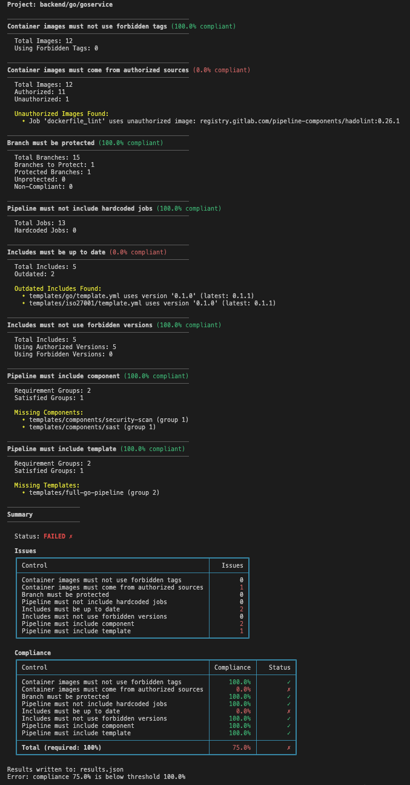

<p align="center">
  
</p>


<p align="center">
  <b>CI/CD compliance scanner for GitLab pipelines</b>
</p>

<p align="center">
  <a href="https://github.com/getplumber/plumber/actions"></a>
  <a href="https://github.com/getplumber/plumber/releases"></a>
  
  <a href="https://github.com/getplumber/plumber/releases"></a>
  <a href="https://hub.docker.com/r/getplumber/plumber"></a>
  <a href="LICENSE"></a>
</p>

<p align="center">
  <a href="https://getplumber.io">Website</a> •
  <a href="https://discord.gg/932xkSU24f">Discord</a> •
  <a href="https://github.com/getplumber/plumber/issues">Issues</a>
</p>

---

## 🤔 What is Plumber?

Plumber is a compliance scanner for GitLab. It reads your `.gitlab-ci.yml` and repository settings, then checks for security and compliance issues like:

- Container images using mutable tags (`latest`, `dev`)
- Container images from untrusted registries
- Unprotected branches
- Hardcoded jobs not from external includes/components
- Outdated includes/templates
- Forbidden version patterns (e.g., `main`, `HEAD`)
- Missing required components or templates

**How does it work?** Plumber connects to your GitLab instance via API, analyzes your pipeline configuration, and reports any issues it finds. You define what's allowed in a config file (`.plumber.yaml`), and Plumber tells you if your project complies. When running locally from your git repo, Plumber uses your **local `.gitlab-ci.yml`** allowing you to validate changes before pushing.

<p align="center">
  
</p>

## 🚀 Two Ways to Use Plumber

Choose **one** of these methods. You don't need both:

| Method | Best for | How it works |
|--------|----------|--------------|
| **[CLI](#option-1-cli)** | Quick evaluation, local testing, one-off scans | Install binary and run from terminal |
| **[GitLab CI Component](#option-2-gitlab-ci-component)** | Automated checks on every pipeline run | Add 2 lines to your `.gitlab-ci.yml` |

---

## 📖 Table of Contents

- [What is Plumber?](#-what-is-plumber)
- [CLI](#option-1-cli)
- [GitLab CI Component](#option-2-gitlab-ci-component)
- [Configuration](#%EF%B8%8F-configuration)
  - [Available Controls](#available-controls)
- [Artifacts & Outputs](#-artifacts--outputs)
  - [JSON Report](#json-report)
  - [Pipeline Bill of Materials (PBOM)](#pipeline-bill-of-materials-pbom)
  - [CycloneDX SBOM](#cyclonedx-sbom)
  - [Terminal Output](#terminal-output)
- [GitLab Integration](#-gitlab-integration)
  - [Merge Request Comments](#merge-request-comments)
  - [Project Badges](#project-badges)
- [Installation](#-installation)
- [CLI Reference](#-cli-reference)
- [Self-Hosted GitLab](#%EF%B8%8F-self-hosted-gitlab)
- [Troubleshooting](#-troubleshooting)
- [See it in action](#-see-it-in-action)
- [Blog Posts & Articles](#-blog-posts--articles)


---

## Option 1: CLI

**Try Plumber in 2 minutes!** No commits, no CI changes, just run it.

### Step 1: Install

Choose **one** of the following:

#### Homebrew

```bash
brew tap getplumber/plumber
brew install plumber
```

#### Mise

```bash
mise use -g github:getplumber/plumber
```

> Requires [mise activation](https://mise.jdx.dev/getting-started.html#activate-mise) in your shell, or run with `mise exec -- plumber`.

#### Direct Download

```bash
# For Linux/MacOs
curl -LO "https://github.com/getplumber/plumber/releases/latest/download/plumber-$(uname -s | tr '[:upper:]' '[:lower:]')-$(uname -m | sed 's/x86_64/amd64/' | sed 's/aarch64/arm64/')"
chmod +x plumber-* && sudo mv plumber-* /usr/local/bin/plumber
```

> 📦 See [Installation](#-installation) for Windows, Docker, or building from source.

### Step 2: Generate a Config File

```bash
plumber config generate
```

This creates `.plumber.yaml` with [default](./.plumber.yaml) compliance rules. You can customize it later.

### Step 3: Create & Set Your Token

1. In GitLab, go to **User Settings → Access Tokens** ([direct link](https://gitlab.com/-/user_settings/personal_access_tokens))
2. Create a Personal Access Token with `read_api` + `read_repository` scopes
3. Export it in your terminal:

> ⚠️ **Important:** The token must belong to a user with **Maintainer** role (or higher) on the project to access branch protection settings and other project configurations.

```bash
export GITLAB_TOKEN=glpat-xxxx
```

### Step 4: Run Analysis

Plumber auto-detects the GitLab URL and project from your git remote but requires the remote to be set to 'origin'. 
```bash
# if in git remote with remote = origin, run:
plumber analyze

# Or specify the project explicitly:
plumber analyze --gitlab-url https://gitlab.com --project mygroup/myproject
```
   
It reads your `.plumber.yaml` config and outputs a compliance report. You can also tell it to store the output in JSON format with the `--output` flag.

#### Local CI Configuration

When running from your project's git repository, Plumber automatically uses your **local `.gitlab-ci.yml`** instead of fetching it from the remote. This lets you validate changes before pushing.

The source of the `.gitlab-ci.yml` is resolved by priority:

1. **`--branch` is specified** → always uses the remote file from that branch
2. **In a git repo** and the local repo matches the analyzed project → uses the local file
3. **Otherwise** → uses the remote file from the project's default branch

If the local CI configuration is invalid, Plumber exits with an error showing the specific validation messages from GitLab so you can fix issues before pushing.

> **Note:** When using local CI configuration, `include:local` files are also read from your local filesystem. Other include types (components, templates, project files, remote URLs) are always resolved from their remote sources. Jobs from `include:local` files are treated as hardcoded by the analysis since they are project-specific and not from reusable external sources.

> 💡 **Like what you see?** Add Plumber to your CI/CD with the [GitLab CI Component](#option-2-gitlab-ci-component) for automated checks on every pipeline.

---

## Option 2: GitLab CI Component

**Add Plumber to your GitLab pipeline**: it will run automatically on the default branch, tags and open merge requests.

> 💬 These instructions are for **gitlab.com**. Self-hosted? See [Self-Hosted GitLab](#%EF%B8%8F-self-hosted-gitlab).

### Step 1: Create a GitLab Token

1. In GitLab, go to **User Settings → Access Tokens** ([or create one here](https://gitlab.com/-/user_settings/personal_access_tokens))
2. Create a Personal Access Token with `read_api` + `read_repository` scopes
3. Go to your project's **Settings → CI/CD → Variables**
4. Add the token as `GITLAB_TOKEN` (masked recommended)

> ⚠️ **Important:** The token must belong to a user with **Maintainer** role (or higher) on the project to access branch protection settings and other project configurations.
>
> **Using `mr_comment` or `badge`?** The token needs the `api` scope (instead of `read_api`) to create/update merge request comments or project badges.


### Step 2: Add to Your Pipeline

Add this to your `.gitlab-ci.yml`:

```yaml
include:
  - component: gitlab.com/getplumber/plumber/plumber@v0.1.27
```
* Get the latest version from the [Catalog](https://gitlab.com/explore/catalog/getplumber/plumber)

### Step 3: Run Your Pipeline

That's it! Plumber will now run on every pipeline and report compliance issues.

> 💡 **Want to customize?** See [Configuration](#%EF%B8%8F-configuration) to set thresholds, enable/disable controls, and whitelist trusted images.

---

## ⚙️ Configuration

### GitLab CI Component Inputs

Override any input to fit your needs:

```yaml
include:
  - component: gitlab.com/getplumber/plumber/plumber@v0.1.27
    inputs:
      threshold: 80                           # Minimum % to pass (default: 100)
      config_file: configs/my-plumber.yaml    # Custom config path
      verbose: true                           # Debug output
```

> 📦 Find the latest version on the [GitLab CI/CD Catalog](https://gitlab.com/explore/catalog/getplumber/plumber)

<details>
<summary><b>All available inputs</b></summary>

| Input | Default | Description |
|-------|---------|-------------|
| `server_url` | `$CI_SERVER_URL` | GitLab instance URL |
| `project_path` | `$CI_PROJECT_PATH` | Project to analyze |
| `branch` | `$CI_COMMIT_REF_NAME` | Branch to analyze |
| `gitlab_token` | `$GITLAB_TOKEN` | GitLab API token (requires `read_api` + `read_repository`) |
| `threshold` | `100` | Minimum compliance % to pass |
| `config_file` | *(auto-detect)* | Path to config file (relative to repo root) |
| `output_file` | `plumber-report.json` | Path to write JSON results |
| `pbom_file` | `plumber-pbom.json` | Path to write PBOM output |
| `pbom_cyclonedx_file` | `plumber-cyclonedx-sbom.json` | Path to write CycloneDX SBOM (auto-uploaded as GitLab report) |
| `print_output` | `true` | Print text output to stdout |
| `stage` | `.pre` | Pipeline stage for the job |
| `image` | `getplumber/plumber:0.1` | Docker image to use |
| `allow_failure` | `false` | Allow job to fail without blocking |
| `verbose` | `false` | Enable debug output |
| `mr_comment` | `false` | Post/update a compliance comment on the merge request (requires `api` scope) |
| `badge` | `false` | Create/update a Plumber compliance badge on the project (requires `api` scope; only runs on default branch) |
| `controls` | — | Run only listed controls (comma-separated). Cannot be used with `skip_controls` |
| `skip_controls` | — | Skip listed controls (comma-separated). Cannot be used with `controls` |
| `fail_warnings` | `false` | Treat configuration warnings (unknown keys) as errors (exit 1) |

</details>

### Configuration File

Generate a default configuration file with:

```bash
plumber config generate

Flags:
  -f, --force           Overwrite existing file
  -o, --output string   Output file path (default ".plumber.yaml")
```

This creates `.plumber.yaml` with sensible [defaults](./.plumber.yaml). Customize it to fit your needs.

### Available Controls

Plumber includes 8 compliance controls. Each can be enabled/disabled and customized in [.plumber.yaml](.plumber.yaml):

<details>
<summary><b>1. Container images must not use forbidden tags</b></summary>

Detects container images using mutable tags that are expected to change unexpectedly.

When `containerImagesMustBePinnedByDigest` is set to `true`, this control operates in strict mode:
**all** images must be pinned by digest (e.g., `alpine@sha256:...`). This takes precedence over the
forbidden tags list even standard version tags like `alpine:3.19` or `node:20` will be flagged.

```yaml
containerImageMustNotUseForbiddenTags:
  enabled: true
  tags:
    - latest
    - dev
    - development
    - staging
    - main
    - master
  # When true, ALL images must be pinned by digest (takes precedence over tags list)
  containerImagesMustBePinnedByDigest: false
```

</details>

<details>
<summary><b>2. Container images must come from authorized sources</b></summary>

Ensures container images come from trusted registries only.

```yaml
containerImageMustComeFromAuthorizedSources:
  enabled: true
  trustDockerHubOfficialImages: true
  trustedUrls:
    - docker.io/docker:*
    - gcr.io/kaniko-project/*
    - $CI_REGISTRY_IMAGE:*
    - $CI_REGISTRY_IMAGE/*
    - getplumber/plumber:*
    - docker.io/getplumber/plumber:*
    - registry.gitlab.com/security-products/*
```

</details>

<details>
<summary><b>3. Branch must be protected</b></summary>

Verifies that critical branches have proper protection settings.

```yaml
branchMustBeProtected:
  enabled: true
  defaultMustBeProtected: true
  namePatterns:
    - main
    - master
    - release/*
    - production
    - dev
  allowForcePush: false
  codeOwnerApprovalRequired: false
  minMergeAccessLevel: 30   # Developer
  minPushAccessLevel: 40    # Maintainer
```

</details>

<details>
<summary><b>4. Pipeline must not include hardcoded jobs</b></summary>

Detects jobs that are project-specific rather than coming from reusable external sources (components, templates, project file includes from other repos, remote URLs). This includes jobs defined directly in `.gitlab-ci.yml` as well as jobs from `include:local` files since local includes are just the project's CI config split across files, not reusable external sources.

```yaml
pipelineMustNotIncludeHardcodedJobs:
  enabled: true
```

</details>

<details>
<summary><b>5. Includes must be up to date</b></summary>

Checks if included templates/components have newer versions available.

```yaml
includesMustBeUpToDate:
  enabled: true
```

</details>

<details>
<summary><b>6. Includes must not use forbidden versions</b></summary>

Prevents use of mutable version references for includes that can change unexpectedly.

```yaml
includesMustNotUseForbiddenVersions:
  enabled: true
  forbiddenVersions:
    - latest
    - "~latest"
    - main
    - master
    - HEAD
  defaultBranchIsForbiddenVersion: false
```

</details>

<details>
<summary><b>7. Pipeline must include component</b></summary>

Ensures required GitLab CI/CD components are included in the pipeline.

There are two ways to define requirements (use one, not both):

**Expression syntax**: a natural boolean expression using `AND`, `OR`, and parentheses:

```yaml
pipelineMustIncludeComponent:
  enabled: true
  # AND binds tighter than OR, so "a AND b OR c" means "(a AND b) OR c"
  required: components/sast/sast AND components/secret-detection/secret-detection

  # With alternatives:
  # required: (components/sast/sast AND components/secret-detection/secret-detection) OR your-org/full-security/full-security
```

**Array syntax**: a list of groups using "OR of ANDs" logic:

```yaml
pipelineMustIncludeComponent:
  enabled: true
  # Outer array = OR (at least one group must be satisfied)
  # Inner array = AND (all components in group must be present)
  requiredGroups:
    - ["components/sast/sast", "components/secret-detection/secret-detection"]
    - ["your-org/full-security/full-security"]
```

</details>

<details>
<summary><b>8. Pipeline must include template</b></summary>

Ensures required templates (project includes) are present in the pipeline.

There are two ways to define requirements (use one, not both):

**Expression syntax**: a natural boolean expression using `AND`, `OR`, and parentheses:

```yaml
pipelineMustIncludeTemplate:
  enabled: true
  required: templates/go/go AND templates/trivy/trivy AND templates/iso27001/iso27001

  # With alternatives:
  # required: (templates/go/go AND templates/trivy/trivy) OR templates/full-go-pipeline
```

**Array syntax**: a list of groups using "OR of ANDs" logic:

```yaml
pipelineMustIncludeTemplate:
  enabled: true
  requiredGroups:
    - ["templates/go/go", "templates/trivy/trivy", "templates/iso27001/iso27001"]
    - ["templates/full-go-pipeline"]
```

</details>

### Selective Control Execution

You can run or skip specific controls using their YAML key names from `.plumber.yaml`. This is useful for iterative debugging or targeted CI checks.

**Run only specific controls:**

```bash
# Only check image tags and branch protection
plumber analyze --controls containerImageMustNotUseForbiddenTags,branchMustBeProtected
```

**Skip specific controls:**

```bash
# Run everything except branch protection (avoids API calls you don't need)
plumber analyze --skip-controls branchMustBeProtected
```

**In the GitLab CI component:**

```yaml
include:
  - component: gitlab.com/getplumber/plumber/plumber@v0.1.27
    inputs:
      controls: containerImageMustNotUseForbiddenTags,containerImageMustComeFromAuthorizedSources
```

Controls not selected are reported as **skipped** in the output. The `--controls` and `--skip-controls` flags are mutually exclusive.

<details>
<summary><b>Valid control names</b></summary>

| Control Name |
|-------------|
| `branchMustBeProtected` |
| `containerImageMustComeFromAuthorizedSources` |
| `containerImageMustNotUseForbiddenTags` |
| `includesMustBeUpToDate` |
| `includesMustNotUseForbiddenVersions` |
| `pipelineMustIncludeComponent` |
| `pipelineMustIncludeTemplate` |
| `pipelineMustNotIncludeHardcodedJobs` |

</details>

---

## 📊 Artifacts & Outputs

Plumber generates multiple output formats to fit different workflows. All artifacts are available via CLI flags and are automatically configured when using the GitLab CI component.

| Format | CLI Flag | CLI Default | Component Default | Description |
|--------|----------|-------------|-------------------|-------------|
| **Terminal** | `--print` | `true` | `true` | Colorized compliance report |
| **JSON Report** | `--output` | — | `plumber-report.json` | Machine-readable analysis results |
| **PBOM** | `--pbom` | — | `plumber-pbom.json` | Pipeline Bill of Materials |
| **CycloneDX** | `--pbom-cyclonedx` | — | `plumber-cyclonedx-sbom.json` | Standard SBOM format |

### JSON Report

Export the full analysis results in JSON format for CI integration, dashboards, or further processing:

```bash
plumber analyze --output plumber-report.json
```

The JSON includes all control results, compliance scores, issues found, and project metadata.

### Pipeline Bill of Materials (PBOM)

Generate a complete inventory of all dependencies in your CI/CD pipeline:

```bash
plumber analyze --pbom pbom.json
```

The PBOM includes:
- **Container images** with registry, tag, and digest information
- **CI/CD components** with version and source
- **Templates** and includes with version tracking
- **Compliance status** for each dependency

### CycloneDX SBOM

Generate a standards-compliant SBOM for security tool integration:

```bash
plumber analyze --pbom-cyclonedx pipeline-sbom.json
```

The CycloneDX output follows the [CycloneDX 1.5 specification](https://cyclonedx.org/docs/1.5/json/) and is compatible with:
- **Grype** and **Trivy** for vulnerability scanning
- **Dependency-Track** for continuous monitoring
- **GitLab Dependency Scanning** (auto-uploaded when using the component)

> **Note:** CI/CD components and templates do not have CVEs in public vulnerability databases. The PBOM is primarily an **inventory and compliance tool**. For image vulnerability scanning, use dedicated tools like `trivy image` or `grype`.

📖 See [docs/PBOM.md](docs/PBOM.md) for full format documentation and field reference.

### Terminal Output

Plumber provides colorized terminal output for easy scanning:

<p align="center">
  
</p>

- **Green checkmarks (✓)** indicate passing controls
- **Red crosses (✗)** indicate failing controls  
- **Yellow bullets (•)** highlight specific issues found
- Summary tables show compliance percentages at a glance

---

## 🔗 GitLab Integration

Plumber integrates directly with GitLab to provide visual compliance feedback where your team works.

### Merge Request Comments

Automatically post compliance summaries on merge requests to catch issues before they're merged.

```yaml
include:
  - component: gitlab.com/getplumber/plumber/plumber@v0.1.27
    inputs:
      mr_comment: true  # Requires api scope on token
```

<p align="center">
  
</p>

**Features:**
- Shows compliance badge with pass/fail status
- Lists all controls with individual compliance percentages
- Details specific issues found with job names and image references
- Automatically updates on each pipeline run (doesn't create duplicate comments)

> ⚠️ **Token requirement:** The `api` scope is required (not `read_api`) to create/update MR comments.

### Project Badges

Display a live compliance badge on your project's overview page.

```yaml
include:
  - component: gitlab.com/getplumber/plumber/plumber@v0.1.27
    inputs:
      badge: true  # Requires api scope on token
```

<p align="center">
  
</p>

**Features:**
- Shows current compliance percentage
- **Green** when compliance meets threshold, **red** when below
- Only updates on default branch pipelines (not on MRs or feature branches)
- Badge appears in GitLab's "Project information" section

> ⚠️ **Token requirement:** The `api` scope is required (not `read_api`) and Maintainer role to manage project badges.

---

## 📦 Installation

### Homebrew

```bash
brew tap getplumber/plumber
brew install plumber
```

To install a specific version:

```bash
brew install getplumber/plumber/plumber@0.1.44
```

> **Note:** Versioned formulas are keg-only. Use the full path for example `/usr/local/opt/plumber@0.1.44/bin/plumber` or run `brew link plumber@0.1.44` to add it to your PATH.

### Mise

```bash
mise use -g github:getplumber/plumber
```

> Requires [mise activation](https://mise.jdx.dev/getting-started.html#activate-mise) in your shell, or run with `mise exec -- plumber`.

### Binary Download

<details>
<summary><b>Linux (amd64)</b></summary>

```bash
curl -LO https://github.com/getplumber/plumber/releases/latest/download/plumber-linux-amd64
chmod +x plumber-linux-amd64
sudo mv plumber-linux-amd64 /usr/local/bin/plumber
```

</details>

<details>
<summary><b>Linux (arm64)</b></summary>

```bash
curl -LO https://github.com/getplumber/plumber/releases/latest/download/plumber-linux-arm64
chmod +x plumber-linux-arm64
sudo mv plumber-linux-arm64 /usr/local/bin/plumber
```

</details>

<details>
<summary><b>macOS (Apple Silicon)</b></summary>

```bash
curl -LO https://github.com/getplumber/plumber/releases/latest/download/plumber-darwin-arm64
chmod +x plumber-darwin-arm64
sudo mv plumber-darwin-arm64 /usr/local/bin/plumber
```

</details>

<details>
<summary><b>macOS (Intel)</b></summary>

```bash
curl -LO https://github.com/getplumber/plumber/releases/latest/download/plumber-darwin-amd64
chmod +x plumber-darwin-amd64
sudo mv plumber-darwin-amd64 /usr/local/bin/plumber
```

</details>

<details>
<summary><b>Windows (PowerShell)</b></summary>

```powershell
Invoke-WebRequest -Uri https://github.com/getplumber/plumber/releases/latest/download/plumber-windows-amd64.exe -OutFile plumber.exe
```

</details>

<details>
<summary><b>Verify checksum</b></summary>

```bash
curl -LO https://github.com/getplumber/plumber/releases/latest/download/checksums.txt
sha256sum -c checksums.txt --ignore-missing
```

</details>

### Docker

```bash
docker pull getplumber/plumber:latest

docker run --rm \
  -e GITLAB_TOKEN=glpat-xxxx \
  getplumber/plumber:latest analyze \
  --gitlab-url https://your-gitlab-instance.com \ 
  --project mygroup/myproject
```

### Build from Source

> Requires Go 1.24+ and Make.

```bash
git clone https://github.com/getplumber/plumber.git
cd plumber
make build # or make install to build and copy to /usr/local/bin/
```

---

## 🔍 CLI Reference

### `plumber analyze`

Run compliance analysis on a GitLab project.

```bash
plumber analyze [flags]
```

### Flags

| Flag | Required | Default | Description |
|------|----------|---------|-------------|
| `--gitlab-url` | No* | auto-detect | GitLab instance URL |
| `--project` | No* | auto-detect | Project path (e.g., `group/project`) |
| `--config` | No | `.plumber.yaml` | Path to config file |
| `--threshold` | No | `100` | Minimum compliance % to pass (0-100) |
| `--branch` | No | default | Branch to analyze |
| `--output` | No | — | Write JSON results to file |
| `--pbom` | No | — | Write PBOM (Pipeline Bill of Materials) to file |
| `--pbom-cyclonedx` | No | — | Write PBOM in CycloneDX SBOM format |
| `--print` | No | `true` | Print text output to stdout |
| `--mr-comment` | No | `false` | Post/update a compliance comment on the merge request (MR pipelines only: requires `api` scope) |
| `--badge` | No | `false` | Create/update a Plumber compliance badge on the project (requires `api` scope; only runs on default branch) |
| `--controls` | No | — | Run only listed controls (comma-separated). Cannot be used with `--skip-controls` |
| `--skip-controls` | No | — | Skip listed controls (comma-separated). Cannot be used with `--controls` |
| `--fail-warnings` | No | `false` | Treat configuration warnings (unknown keys) as errors (exit 1) |
| `--verbose`, `-v` | No | `false` | Enable verbose/debug output for troubleshooting |

> \* Auto-detected from git remote (`origin`) if not specified. Supports both SSH and HTTPS remote URLs.

### Environment Variables

| Variable | Required | Description |
|----------|----------|-------------|
| `GITLAB_TOKEN` | Yes | GitLab API token with `read_api` + `read_repository` scopes (from a Maintainer or higher). Use `api` scope instead if `--mr-comment` or `--badge` is enabled. |

### Exit Codes

| Code | Meaning |
|------|---------|
| `0` | Compliance ≥ threshold |
| `1` | Compliance < threshold or error |

### `plumber config generate`

Generate a default `.plumber.yaml` configuration file.

```bash
plumber config generate [flags]
```

| Flag | Default | Description |
|------|---------|-------------|
| `--output`, `-o` | `.plumber.yaml` | Output file path |
| `--force`, `-f` | `false` | Overwrite existing file |

**Examples:**

```bash
# Generate default config
plumber config generate

# Custom filename
plumber config generate --output my-plumber.yaml

# Overwrite existing conf file
plumber config generate --force
```

### `plumber config view`

Display a clean, human-readable view of the effective configuration without comments.

```bash
plumber config view [flags]
```

| Flag | Default | Description |
|------|---------|-------------|
| `--config`, `-c` | `.plumber.yaml` | Path to configuration file |
| `--no-color` | `false` | Disable colorized output |

Booleans are colorized for quick scanning: `true` in green, `false` in red. Color is automatically disabled when piping output.

**Examples:**

```bash
# View the default .plumber.yaml
plumber config view

# View a specific config file
plumber config view --config custom-plumber.yaml

# View without colors (for piping or scripts)
plumber config view --no-color
```

### `plumber config validate`

Validate a configuration file for correctness. Detects unknown control names and sub-keys with typo suggestions using fuzzy matching.

```bash
plumber config validate [flags]
```

| Flag | Default | Description |
|------|---------|-------------|
| `--config`, `-c` | `.plumber.yaml` | Path to configuration file |
| `--fail-warnings` | `false` | Treat configuration warnings as errors (exit 1) |

Warnings are printed to stderr so they don't interfere with scripted output. Use `--fail-warnings` to exit with code 1 when warnings are found (useful in CI).

**Examples:**

```bash
# Validate the default .plumber.yaml
plumber config validate

# Validate a specific config file
plumber config validate --config custom-plumber.yaml

# Fail on warnings (for CI pipelines)
plumber config validate --fail-warnings
```

**Sample output with typos:**

```
Configuration validation warnings:
  - Unknown control in .plumber.yaml: "containerImageMustNotUseForbiddenTag". Did you mean "containerImageMustNotUseForbiddenTags"?
  - Unknown key "tag" in control "containerImageMustNotUseForbiddenTags". Did you mean "tags"?
  - Unknown key "allowForcePushes" in control "branchMustBeProtected". Did you mean "allowForcePush"?
```

---

## ⚠️ Self-Hosted GitLab

If you're running a self-hosted GitLab instance, you'll need to host your own copy of the component.

<details>
<summary><b>Step-by-step setup</b></summary>

**Step 1: Import the repository**

- Go to **New Project → Import project → Repository by URL**
- URL: `https://gitlab.com/getplumber/plumber.git`
- Choose a group/project name (e.g., `infrastructure/plumber`)

**Step 2: Enable CI/CD Catalog**

- Go to **Settings → General**
- Make sure the project has a **description** (required for CI/CD Catalog)
- Expand **Visibility, project features, permissions**
- Toggle **CI/CD Catalog resource** to enabled
- Click **Save changes**

**Step 3: Create a release**

- Go to **Code → Tags → New tag**
- Enter a version (e.g., `1.0.0`)
- Click **Create tag**

**Step 4: Create a GitLab Token**

In the project you want to scan:

1. Go to **User Settings → Access Tokens** on your GitLab instance
2. Create a Personal Access Token with `read_api` + `read_repository` scopes (or `api` if using `mr_comment` or `badge`)
3. Go to the project's **Settings → CI/CD → Variables**
4. Add the token as `GITLAB_TOKEN` (masked recommended)

> ⚠️ The token must belong to a user with **Maintainer** role (or higher) on the project.

**Step 5: Use in your pipelines**

```yaml
include:
  - component: gitlab.example.com/infrastructure/plumber/plumber@v1.0.0
```

> 💡 Format: `<your-gitlab-host>/<project-path>/plumber@<tag>`

</details>

---

## 🔧 Troubleshooting

| Issue | Solution |
|-------|----------|
| `GITLAB_TOKEN environment variable is required` | Set `GITLAB_TOKEN` in CI/CD Variables or export it locally |
| `401 Unauthorized` | Token needs `read_api` + `read_repository` scopes, from a Maintainer or higher |
| `403 Forbidden` on MR settings | Expected on non-Premium GitLab; continues without that data |
| `403 Forbidden` on MR comment | Token needs `api` scope (not `read_api`) when `--mr-comment` is enabled |
| `403 Forbidden` on badge | Token needs `api` scope (not `read_api`) when `--badge` is enabled |
| `404 Not Found` | Verify project path and GitLab URL are correct |
| MR comment not posted | `--mr-comment` only works in merge request pipelines (`CI_MERGE_REQUEST_IID` must be set) |
| Badge not created/updated | Token needs `api` scope and Maintainer role (or higher) on the project |
| Configuration file not found | Use absolute path in Docker, relative path otherwise |

> 💡 **Need help?** [Open an issue](https://github.com/getplumber/plumber/issues) or [join our Discord](https://discord.gg/932xkSU24f)


---

## 🤝 Contributing

Contributions are welcome! Please read our [Contributing Guide](CONTRIBUTING.md) for details on how to submit pull requests, report issues, and coding conventions.

---

## 💡 See it in action 
Check out our example projects:
- [go-build-test-compliant](https://gitlab.com/getplumber/examples/go-build-test-compliant/-/pipelines) - A compliant project passing all checks
- [go-build-test-non-compliant](https://gitlab.com/getplumber/examples/go-build-test-non-compliant/-/pipelines) - A non-compliant project showing detected issues
- [go-build-test-with-hash](https://gitlab.com/getplumber/examples/go-test-with-hash/-/pipelines)  - A partially compliant project with digest-pinned images
- [go-test-with-local-include](https://gitlab.com/getplumber/examples/go-test-with-local-include/-/pipelines) - A Partially compliant project with local file inclusions

---

## 📰 Blog Posts & Articles

### English

- [Your GitLab Pipelines Are Probably Non-Compliant — Here's How to Fix That in 5 Minutes](https://medium.com/@moukarzeljoseph/your-gitlab-pipelines-are-probably-non-compliant-heres-how-to-fix-that-in-5-minutes-5009614a1fb1) — Medium

### Français

- [Plumber : Vos pipelines GitLab CI/CD sont-ils conformes ?](https://blog.stephane-robert.info/docs/pipeline-cicd/gitlab/outils/plumber/) — Stéphane Robert
- [Plumber : La compliance à portée de main](https://www.linkedin.com/posts/bbenjamin28_plumber-la-compliance-%C3%A0-port%C3%A9e-de-main-activity-7427248795173699584-vxV4/) — Benjamin Bacle, LinkedIn

## 📄 License

[Mozilla Public License 2.0 (MPL-2.0)](LICENSE)


## Star History

[](https://www.star-history.com/#getplumber/plumber&type=date&legend=top-left)
