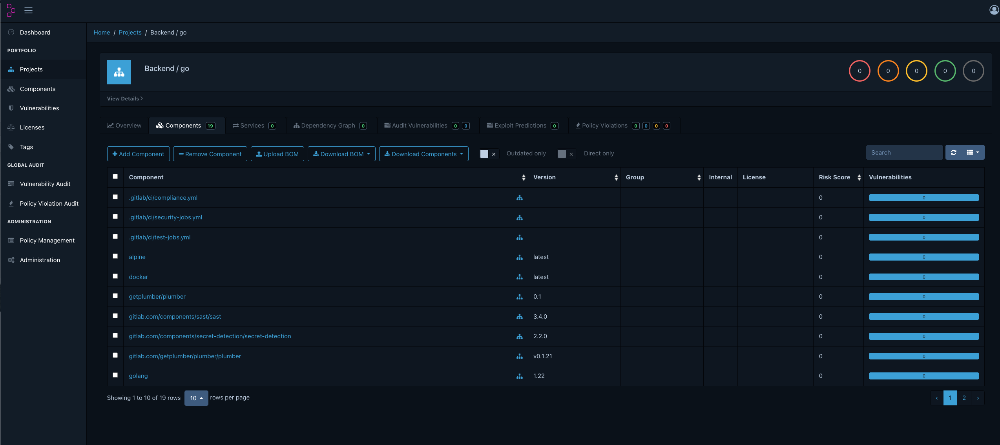

# PBOM Testing & Validation Guide

This guide covers how to test and validate Plumber's PBOM output with security and compliance tools.

> For PBOM format documentation, field reference, CycloneDX vs SPDX rationale, and vulnerability detection expectations, see [PBOM.md](./PBOM.md).

## Table of Contents

- [CycloneDX CLI (Validation)](#cyclonedx-cli-validation)
- [Grype (Vulnerability Scanning)](#grype-vulnerability-scanning)
- [Trivy (Security Scanning)](#trivy-security-scanning)
- [Dependency-Track (Dashboard)](#dependency-track-dashboard)
- [JSON Schema Validation](#json-schema-validation)
- [Troubleshooting](#troubleshooting)

---

## CycloneDX CLI (Validation)

The official CycloneDX CLI validates SBOM files against the CycloneDX specification.

### Installation

**macOS (Homebrew) - Recommended:**
```bash
brew install cyclonedx/cyclonedx/cyclonedx-cli
```

**Windows (Chocolatey):**
```powershell
choco install cyclonedx-cli
```

**Linux/macOS (Direct Download):**
```bash
# Check latest version at https://github.com/CycloneDX/cyclonedx-cli/releases
export VERSION="0.29.2"

# macOS Apple Silicon (ARM64)
curl -LO "https://github.com/CycloneDX/cyclonedx-cli/releases/download/v${VERSION}/cyclonedx-osx-arm64"
chmod +x cyclonedx-osx-arm64
sudo mv cyclonedx-osx-arm64 /usr/local/bin/cyclonedx

# macOS Intel (x64)
curl -LO "https://github.com/CycloneDX/cyclonedx-cli/releases/download/v${VERSION}/cyclonedx-osx-x64"
chmod +x cyclonedx-osx-x64
sudo mv cyclonedx-osx-x64 /usr/local/bin/cyclonedx

# Linux (x64)
curl -LO "https://github.com/CycloneDX/cyclonedx-cli/releases/download/v${VERSION}/cyclonedx-linux-x64"
chmod +x cyclonedx-linux-x64
sudo mv cyclonedx-linux-x64 /usr/local/bin/cyclonedx
```

**Docker (x64 only - NOT supported on Apple Silicon):**
```bash
# ⚠️ Only works on x64 architecture
docker pull cyclonedx/cyclonedx-cli
```

> **Note:** The CycloneDX CLI Docker image does not support ARM64/Apple Silicon. Use Homebrew or direct download instead.

### Usage

```bash
# Validate a CycloneDX JSON file
cyclonedx validate --input-file pipeline-sbom.json --input-format json

# Validate with specific spec version
cyclonedx validate --input-file pipeline-sbom.json --input-format json --input-version v1_5

# Convert between formats (JSON to XML)
cyclonedx convert --input-file pipeline-sbom.json --input-format json --output-file pipeline-sbom.xml --output-format xml
```

### Docker Usage (x64 only)

> **⚠️ Not supported on Apple Silicon (ARM64).** Use Homebrew or direct download instead.

```bash
docker run --rm -v $(pwd):/data cyclonedx/cyclonedx-cli validate \
  --input-file /data/pipeline-sbom.json \
  --input-format json
```

### Expected Output

```
BOM validated successfully.
```

If invalid, you'll see specific validation errors.

---

## Grype (Vulnerability Scanning)

Grype is a vulnerability scanner for container images and SBOMs by Anchore.

### Installation

**macOS (Homebrew):**
```bash
brew install grype
```

**Linux (curl):**
```bash
curl -sSfL https://raw.githubusercontent.com/anchore/grype/main/install.sh | sh -s -- -b /usr/local/bin
```

**Docker:**
```bash
docker pull anchore/grype:latest
```

### Updating

```bash
# Homebrew
brew upgrade grype

# Update vulnerability database
grype db update
```

### Usage

```bash
# Basic scan
grype sbom:pipeline-sbom.json

# Table output (default)
grype sbom:pipeline-sbom.json -o table

# JSON output
grype sbom:pipeline-sbom.json -o json > vulnerabilities.json

# Only show high/critical vulnerabilities
grype sbom:pipeline-sbom.json --fail-on high

# Quiet mode (only show vulnerabilities)
grype sbom:pipeline-sbom.json -q
```

### Docker Usage

```bash
docker run --rm -v $(pwd):/sbom anchore/grype:latest sbom:/sbom/pipeline-sbom.json
```

### Expected Output

For Plumber's CycloneDX SBOM, you will most likely see:

```
 ✔ Scanned for vulnerabilities     [0 vulnerability matches]  
   ├── by severity: 0 critical, 0 high, 0 medium, 0 low, 0 negligible
No vulnerabilities found
```

This is expected — see [Vulnerability Detection: What to Expect](./PBOM.md#vulnerability-detection-what-to-expect). CI/CD components and templates don't have CVEs in public databases. Docker image PURLs may occasionally return limited results based on image metadata, but not a full vulnerability scan.

### CI/CD Integration

```bash
# Fail pipeline if high or critical vulnerabilities found
grype sbom:pipeline-sbom.json --fail-on high
echo $?  # Returns non-zero if vulnerabilities found
```

---

## Trivy (Security Scanning)

Trivy is a comprehensive security scanner by Aqua Security.

### Installation

**macOS (Homebrew):**
```bash
brew install trivy
```

**Linux (apt):**
```bash
sudo apt-get install trivy
```

**Linux (curl):**
```bash
curl -sfL https://raw.githubusercontent.com/aquasecurity/trivy/main/contrib/install.sh | sh -s -- -b /usr/local/bin
```

**Docker:**
```bash
docker pull aquasec/trivy:latest
```

### Updating

```bash
# Homebrew
brew upgrade trivy

# Update vulnerability database
trivy image --download-db-only
```

### Usage

```bash
# Basic SBOM scan
trivy sbom pipeline-sbom.json

# Table format (default)
trivy sbom pipeline-sbom.json --format table

# JSON output
trivy sbom pipeline-sbom.json --format json > trivy-report.json

# Only show high/critical
trivy sbom pipeline-sbom.json --severity HIGH,CRITICAL

# Exit with error code if vulnerabilities found
trivy sbom pipeline-sbom.json --exit-code 1

# Ignore unfixed vulnerabilities
trivy sbom pipeline-sbom.json --ignore-unfixed
```

### Docker Usage

```bash
docker run --rm -v $(pwd):/sbom aquasec/trivy:latest sbom /sbom/pipeline-sbom.json
```

### Expected Output

For Plumber's CycloneDX SBOM, Trivy will most likely report no vulnerabilities:

```
Report Summary

┌────────┬──────┬─────────────────┐
│ Target │ Type │ Vulnerabilities │
├────────┼──────┼─────────────────┤
│   -    │  -   │        -        │
└────────┴──────┴─────────────────┘
Legend:
- '-': Not scanned
- '0': Clean (no security findings detected)
```

This is expected — see [Vulnerability Detection: What to Expect](./PBOM.md#vulnerability-detection-what-to-expect).

### CI/CD Integration

```yaml
# GitLab CI example
trivy-scan:
  image: aquasec/trivy:latest
  script:
    - trivy sbom pipeline-sbom.json --exit-code 1 --severity HIGH,CRITICAL
```

---

## Dependency-Track (Dashboard)

Dependency-Track is a full-featured Software Composition Analysis (SCA) platform with a web dashboard.

### Installation (Docker Compose)

Create a `docker-compose.yml`:

```yaml
services:
  dtrack-apiserver:
    image: dependencytrack/apiserver:latest
    ports:
      - "8081:8080"
    volumes:
      - dtrack-data:/data
    environment:
      - ALPINE_DATABASE_MODE=external
      - ALPINE_DATABASE_URL=jdbc:h2:/data/dtrack
    deploy:
      resources:
        limits:
          memory: 5g
        reservations:
          memory: 4g
    healthcheck:
      test: ["CMD", "wget", "-q", "--spider", "http://localhost:8080/api/version"]
      interval: 10s
      timeout: 5s
      retries: 10
      start_period: 90s
    restart: unless-stopped

  dtrack-frontend:
    image: dependencytrack/frontend:latest
    ports:
      - "8080:8080"
    environment:
      - API_BASE_URL=http://localhost:8081
    depends_on:
      dtrack-apiserver:
        condition: service_healthy
    restart: unless-stopped

volumes:
  dtrack-data:
```

> **Important:** Dependency-Track requires at least **4GB of RAM**. Make sure Docker Desktop has at least **6GB memory** allocated (Settings → Resources → Memory).

Start the services:

```bash
docker compose up -d

# Watch logs until the API server is ready (takes 1-2 minutes)
docker compose logs -f dtrack-apiserver
# Wait for: "Dependency-Track is ready"
```

### Initial Setup

1. Open http://localhost:8080 in your browser
2. Login with default credentials: `admin` / `admin`
3. Change the password when prompted
4. Get an API key: **Administration → Access Management → Teams → Automation** → copy the API Key

### Uploading SBOM via API

```bash
# Set your API key (from Administration → Teams → Automation)
export DTRACK_API_KEY="your-api-key-here"

# Upload SBOM with auto-create project (simplest method)
curl -X POST "http://localhost:8081/api/v1/bom" \
  -H "X-Api-Key: $DTRACK_API_KEY" \
  -F "projectName=my-pipeline" \
  -F "projectVersion=1.0.0" \
  -F "autoCreate=true" \
  -F "bom=@pipeline-sbom.json"
```

**Alternative: Create project first, then upload:**

```bash
# Create project and capture UUID
PROJECT_UUID=$(curl -s -X PUT "http://localhost:8081/api/v1/project" \
  -H "X-Api-Key: $DTRACK_API_KEY" \
  -H "Content-Type: application/json" \
  -d '{"name": "my-pipeline", "version": "1.0.0"}' | jq -r '.uuid')

echo "Project UUID: $PROJECT_UUID"

# Upload SBOM to the project
curl -X POST "http://localhost:8081/api/v1/bom" \
  -H "X-Api-Key: $DTRACK_API_KEY" \
  -F "project=$PROJECT_UUID" \
  -F "bom=@pipeline-sbom.json"
```

### Uploading SBOM via Web UI

1. Navigate to **Projects → Create Project**
2. Fill in project details and save
3. Go to the project and click **Components → Upload BOM**
4. Select your `pipeline-sbom.json` file

### Features

- Vulnerability tracking with NVD, OSS Index, VulnDB
- Policy management and compliance rules
- Notifications (Slack, Teams, email, webhooks)
- Metrics and trends over time
- REST API for CI/CD integration

### Result


<p align="center">
  
</p>

---

## JSON Schema Validation

Validate against the official CycloneDX JSON Schema without installing additional tools.

### Using CycloneDX CLI (Recommended)

The official CycloneDX CLI handles all schema complexities automatically:

```bash
# macOS
brew install cyclonedx/cyclonedx/cyclonedx-cli

# Validate
cyclonedx validate --input-file pipeline-sbom.json --input-format json
```

See the [CycloneDX CLI section](#cyclonedx-cli-validation) above for installation on other platforms.

### Using Python jsonschema

```bash
# Install
pip install jsonschema

# Validate
python << 'EOF'
import json
import urllib.request
from jsonschema import validate, ValidationError

# Load SBOM
with open('pipeline-sbom.json') as f:
    sbom = json.load(f)

# Fetch schema
schema_url = "https://raw.githubusercontent.com/CycloneDX/specification/1.5/schema/bom-1.5.schema.json"
with urllib.request.urlopen(schema_url) as response:
    schema = json.loads(response.read())

# Validate
try:
    validate(instance=sbom, schema=schema)
    print("✓ SBOM is valid!")
except ValidationError as e:
    print(f"✗ Validation error: {e.message}")
EOF
```
### Expected Output
```
✓ SBOM is valid!
```

### Online Validator

Upload your SBOM to: https://cyclonedx.org/tool-center/ (look for validation tools)

---

## Troubleshooting

### "SBOM format not recognized"

Ensure your file starts with the correct CycloneDX header:
```json
{
  "bomFormat": "CycloneDX",
  "specVersion": "1.5",
  ...
}
```

### "No vulnerabilities found" for all components

This is expected for GitLab CI/CD components — they don't have CVEs in standard vulnerability databases. See [Vulnerability Detection: What to Expect](./PBOM.md#vulnerability-detection-what-to-expect) in the PBOM docs.

### Grype/Trivy can't find the file

Use the correct prefix:
```bash
# Grype requires sbom: prefix
grype sbom:pipeline-sbom.json

# Trivy uses sbom subcommand
trivy sbom pipeline-sbom.json
```

### Docker volume mount issues

Ensure you're using absolute paths or `$(pwd)`:
```bash
# Correct
docker run --rm -v $(pwd):/data ...

# Also correct
docker run --rm -v /full/path/to/dir:/data ...
```

### CycloneDX CLI Docker doesn't work on Apple Silicon

The CycloneDX CLI Docker image only supports x64. On Apple Silicon (M1/M2/M3), use:
```bash
# Option 1: Homebrew (recommended)
brew install cyclonedx/cyclonedx/cyclonedx-cli

# Option 2: Direct download (check latest version at https://github.com/CycloneDX/cyclonedx-cli/releases)
curl -LO "https://github.com/CycloneDX/cyclonedx-cli/releases/download/v0.29.2/cyclonedx-osx-arm64"
chmod +x cyclonedx-osx-arm64
sudo mv cyclonedx-osx-arm64 /usr/local/bin/cyclonedx
```

### Database update failures

Update the vulnerability databases:
```bash
# Grype
grype db update

# Trivy
trivy image --download-db-only
```

---

## Quick Reference

| Tool | Install (macOS) | Validate/Scan Command |
|------|-----------------|----------------------|
| CycloneDX CLI | `brew install cyclonedx/cyclonedx/cyclonedx-cli` | `cyclonedx validate --input-file sbom.json --input-format json` |
| Grype | `brew install grype` | `grype sbom:sbom.json` |
| Trivy | `brew install trivy` | `trivy sbom sbom.json` |
| Dependency-Track | Docker Compose | Upload via API or Web UI |

> **Note:** Homebrew installations work on both Intel and Apple Silicon Macs.

---

## See Also

- [PBOM.md](./PBOM.md) — PBOM format documentation, field reference, and design decisions
- [CycloneDX Specification](https://cyclonedx.org/specification/overview/)
- [Grype Documentation](https://github.com/anchore/grype)
- [Trivy Documentation](https://aquasecurity.github.io/trivy/)
- [Dependency-Track Documentation](https://docs.dependencytrack.org/)
